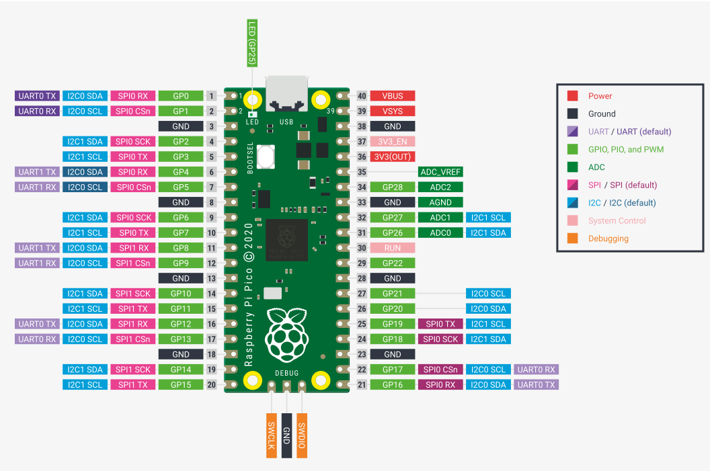
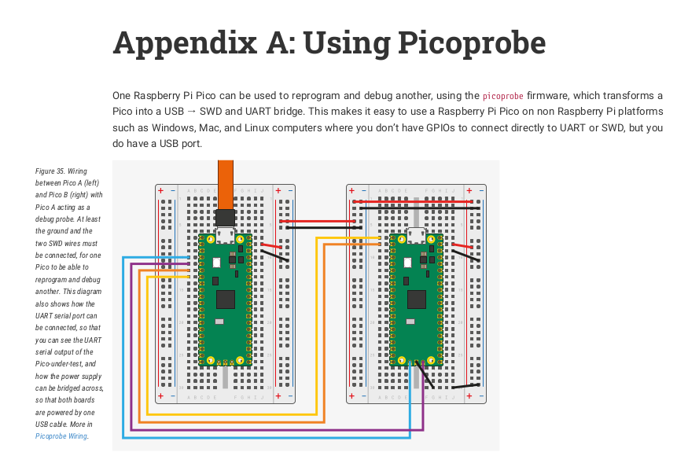

# Rust Raspberry Pi Pico / Rust rp2040 Resources

Setup your Rust installation for rp2040 development:

```
# Add the rp2040 CPU architecture:
rustup self update
rustup update stable
rustup target add thumbv6m-none-eabi

# Useful to creating UF2 images for the RP2040 USB Bootloader
cargo install elf2uf2-rs --locked

# Useful for flashing over the SWD pins using a supported JTAG probe
cargo install --git https://github.com/rp-rs/probe-run.git --branch rp2040-support 

# flip-link detect stack-overflows on the first core
# (which is the only supported target for now.)
cargo install flip-link
```

A broad overview of the rp2040 Rust ecosystem:

- [Github rp-rs org](https://github.com/rp-rs/)
  - [rp2040-project-template](https://github.com/rp-rs/rp2040-project-template)
    You will find infos to setup Rust, probe-run and flip-link here.
  - [rp-hal - rp2040 Hardware Abstraction Layer](https://github.com/rp-rs/rp-hal)
    You will find other useful setup information here.
    - [pico Rust examples](https://github.com/rp-rs/rp-hal/tree/main/boards/pico/examples)
    - [rp2040-hal examples](https://github.com/rp-rs/rp-hal/tree/main/rp2040-hal/examples)
- elf2uf2 converter: `cargo install elf2uf2-rs --locked`
- [Raspberry Pi Pico DapperMime CMSIS-DAP Debug Probe UF2 Image](https://github.com/majbthrd/DapperMime/releases/download/20210225/raspberry_pi_pico-DapperMime.uf2)
  - See also: [https://github.com/rp-rs/rp2040-project-template/blob/main/debug_probes.md](https://github.com/rp-rs/rp2040-project-template/blob/main/debug_probes.md)
- [heapless - statically allocated data structures](https://docs.rs/heapless/0.7.8/heapless/)
- [Cortex-M allocator](https://crates.io/crates/alloc-cortex-m)
Use with care, and "it's probably safer to reserve heap space with linker scripts!"
- rp2040 Rust Project Template with RTIC and USB serial console: https://github.com/joaocarvalhoopen/Raspberry_Pi_Pico_in_Rust__Proj_Template_with_RTIC_USB-Serial_UF2

**See also a another big link list about Embedded Rust here:** https://github.com/rust-embedded/awesome-embedded-rust

## Reading material

- [The Embedded Rust Book](https://doc.rust-lang.org/beta/embedded-book/intro/index.html)

## Determining rp2040 Rust Program Size on Flash and RAM

The easiest overview you can achieve with the `size` tool that comes
with Linux:

```
./target/thumbv6m-none-eabi/release$ size rp2040-pwm-dac-sine-saw-synth
   text	   data	    bss	    dec	    hex	filename
  12176	     48	   1032	  13256	   33c8	rp2040-pwm-dac-sine-saw-synth
```

- `text` is the program code, which resides in flash.
- `data` is the static data of your program, which will end up in flash _and_ RAM.
- `bss` is uninitialized data, which will consume RAM.

You can also install binutils for cargo:

```
    cargo install cargo-binutils

    # also this, or otherwise you will get a "No such file or directory"
    # error when using `cargo nm`:
    rustup component add llvm-tools-preview
```

And then run `cargo nm`:

```
./rp2040_code/pwm_dac_saw_sampling$ cargo nm --release | sort
00000000 N {"package":"defmt","tag":"defmt_prim","data":"{=__internal_Display}","disambiguator":"14725451269531928465"}
...
10000000 r rp2040_pwm_dac_sine_saw_synth::BOOT2::h4551b8283fee8692
10002fe0 D __veneer_limit
2003fbc8 A _stack_start
...
20040000 B __sheap
```

The addresses starting with a `100*` are in flash, and the addresses
starting with `200*` are in RAM.

If you want to know the size of the individual elements, you can use
this command (which I found via `cargo nm -h`):

```
./p2040_code/pwm_dac_saw_sampling$ cargo nm --release -- --print-size --size-sort
100013f6 00000000 T ADC_IRQ_FIFO
...
100001f0 0000000a T main
...
100001fc 00000848 t rp2040_pwm_dac_sine_saw_synth::__cortex_m_rt_main::hff61f1c9c409d1f1
```

The second column is the size of the given symbols. As you can see, the
main function which contains the most code is also the biggest.
The numbers are in hexadecimal, so `0x848` are actually `2120 bytes`.

See also: https://github.com/rust-embedded/cargo-binutils

## Raspberry Pi Pico Pinout



## Connecting the Raspberry Pi Pico Probe



## Assorted Projects / Crates

- [ithinuel ws2812-pio-rs - ws2812 driver that uses the PIO peripheral](https://github.com/ithinuel/ws2812-pio-rs/)
  - There is an example for this here: https://github.com/rp-rs/rp-hal/blob/main/boards/feather_rp2040/examples/feather_neopixel_rainbow.rs
- [WeirdConstructor's collection of Rust stuff](https://github.com/WeirdConstructor/RustRP2040Code)
  - Code for a PWM driven DAC that sythesizes sine and saw waveforms: https://github.com/WeirdConstructor/RustRP2040Code/blob/master/pwm_dac_saw_sampling/src/main.rs
